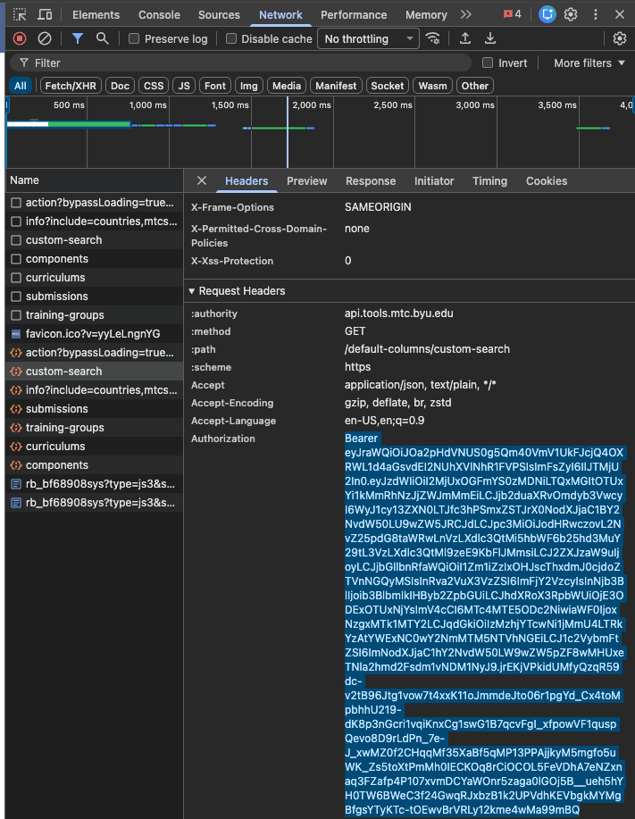

# Meet Your Missionaries and Teaching Missionary Activities
This is the code I wrote for The Church of Jesus Christ of Latter-day Saints Mission Leader Seminar. The code is to be used in Excel. There are three files:
1. import-missionary-data.ts
2. clean-classroom-assignments.ts
3. district-splitter.ts

> **New to maintaining these scripts? Read [Maintaining the scripts](#maintaining-the-scripts-for-future-maintainers) at the bottom first.** It explains where to change sheet/cell names, where errors show up, and the new `Logs` sheet. You should not need to read the rest of the code.

## Importing missionary data (import-missionary-data.ts)
This script will make an API fetch request to tools.mtc.byu.edu to make a custom search for missionaries that will be in the Provo MTC during the seminar. The response is cleaned and written to the _Raw Data_ sheet.

### How to set up
First, copy the code in the file and paste it into a new script in Excel -> Automate -> New Script -> Create in Code Editor. Give it a useful name, like the name of the file. You can then add it to the workbook and replace the old button. Note: the old button will not work anymore because the script that it was linked to was likely deleted.

On your copy of the workbook double check the dates are correct. They should be a large range like this:
| | On-Site | Departure |
| - | ------ | ------- |
| Start | 23-Mar-26 | 18-Jun-26 |
| End | 16-Jun-26 | 28-Sep-26 |

These cells are formulas and should automatically update the dates for the year given in cell A2.

### How to use
In the API Key input you will have to get your MTC Tools API key by inspecting Tools. Since the API key expires after 15 minutes you will have to keep getting a new one. To get the API key:

1. Open [MTC Tools](tools.mtc.byu.edu) and log in.
2. Once on the dashboard right click the window and select **Inspect**.
    - This will open a window that lets you see lots of information about a webpage. We are interested in the network tab so click on **Network**.
3. Now that the **Network** tab is open you can click on **Custom Search** on MTC Tools. As the page loads you will see network traffic showing in the Inspector panel. Look for a packet called **custom-search** and click on it.   
Scroll down on the new information that shows and find the **Authorization** field. The value is the API key. Tripple click on the long string that starts with Bearer and copy (Press <kbd>⌘</kbd> + <kbd>C</kbd> or <kbd>Ctrl</kbd> + <kbd>C</kbd> to copy.) the whole key.

4. Paste the key into the *ControlPanel* sheet on the Excel workbook in cell C8. (Press <kbd>⌘</kbd> + <kbd>Shift</kbd> + <kbd>V</kbd> or <kbd>Ctrl</kbd> + <kbd>Shift</kbd> + <kbd>V</kbd> to paste just the text)

5. You are ready to go! Click the button you added or run the script from the *Office Script* panel in Excel.

## Finding open classrooms (clean-classroom-assignments.ts)
This script will process the classroom assignments report from MTC Tools and return a list of open classrooms based on what day and time the activity is and district temple assignments.

### How to set up
1. Open [MTC Tools](tools.mtc.byu.edu) and log in.
2. Go to **Reports** and find report 119 Classroom Assignments.
3. For the date use the week of semniar and T4 as the building. Click *OK*.
4. Export the report to Excel sheet using the button of the paper with the arrow found at the top right under the report name. 
5. Open the Excel file and copy everything in columns A through M. There will be lots of rows.
6. Paste into the MYM & TYM *classroom assignments* sheet.
7. Do this once a week to get the most up-to-date information about the rooms.
8. While you don't need temple appointments to run the code having this gives you a few more rooms, but **more importantly**, shows you which districts **will not be on campus to participate**. Get the list of appointments from Tyler Peck and copy it to the *Temple Appointments* sheet. New appointments are added each week so stay up to date until the week of seminar has been scheduled. 

### How to use
1. After *classroom assignments* has the updated information you can run the script to filter though classrooms and return a list of open classrooms that can be used for an activity.
2. Select the parameters that you need for **Day of Event** and **Time of Event**.
    - Meet your Missionaries is Wednesday Evening.
    - Teaching Missionaries is Thursday and Friday Afternoon. You can only filter one day at a time so use that parameters for the day you are planning for. 
3. After the script is done the output will be in *Clean Classrooms*.
4. In both the sheets *MYMRooms* and *TYMRooms* the used rooms will show up in AF:AG.
    - Select all the rows of districts and rooms and copy to AC:AD using paste values only! (Press <kbd>⌘</kbd> + <kbd>Shift</kbd> + <kbd>V</kbd> or <kbd>Ctrl</kbd> + <kbd>Shift</kbd> + <kbd>V</kbd> to paste just the text) We don't want the formula. Now all the rooms that can't be used for this activity are red.
    - **For TYM only**, you will want to put a part of a district into their own room but doing so will have the room highlight red if they are in class during that time. This is okay. Simpily remove the district and room from AF:AG and the conditional formating will go back to normal.

## Splitting districts (district-splitter.ts)
This script will use the number of times a district is being used and split the district members up as evenly as possible all while keeping companions together. The output of this script is the slicer number on TYM_Missionary tables. This number assigns that missionary to the mission leader. A district that was not split will all have 1's, a district that was split two ways will have 1's and 2's, ...  
On the sheet, the Use Split column just affects conditional formating and is helpful to know if you split a district already.

### How to set up
As you assign districts to mission leaders the missionaries will show up on the tables to the right. The orange is for Thursday and the green is for Friday. As you start splitting districts up by adding them in more than once the counts wont update until you assign missonaries to that ML.

### How to use
1. Select what day to slice using the dropdown, then click your button or run script through the *Automate* tab.
The script will assign companionships to MLs which will update the counts. 

## Maintaining the scripts (for future maintainers)
These scripts are written so you can keep them working **without reading the code**. Everything that depends on the workbook layout lives in one place, and any problem is reported right in the spreadsheet.

### The CONFIG block
At the very top of each `.ts` file there is a block that looks like this:

```ts
const CONFIG = {
  sheets: { ... },   // names of the worksheets the script uses
  cells:  { ... },   // specific cells it reads from and writes to
  ...
}
```

If you ever **rename a sheet, move a cell, or rename a table**, update the matching value in `CONFIG` and the script will keep working. You should not need to change anything below the `CONFIG` block. Each line in `CONFIG` has a comment explaining what it controls.

A few values worth knowing about:
- **import-missionary-data.ts** -> `CONFIG.minExpectedRecords`: a run is rejected if it returns fewer records than this. If a future year's group is genuinely small and you see "validation failed", lower this number.
- **clean-classroom-assignments.ts** -> `CONFIG.assignmentColumns` / `CONFIG.templeColumns`: these are the column positions in the pasted reports. If MTC Tools changes a report's column order, update these numbers.
- **district-splitter.ts** -> `CONFIG.missionaryColumnIndexes`: column positions in the missionary tables.

### Where errors and progress show up
Every script writes its progress and any error message into a **status cell** on the sheet (the same cell that used to say "Running..."):
- import-missionary-data.ts -> `ControlPanel!G8`
- clean-classroom-assignments.ts -> `ControlPanel!G21`
- district-splitter.ts -> `MP_DistrictMatch!AF1`

If something goes wrong, that cell will now show a plain-language message such as `Error: Your MTC Tools API key has likely expired...` instead of staying stuck on "Running". Read that cell first when a script does not behave.

### The Logs sheet
The first time any script runs it creates a sheet named **Logs** with four columns: Timestamp, Level (INFO/WARN/ERROR), Function, and Message. This is a running history of what each script did, useful for figuring out why a run produced unexpected results. It cleans itself up automatically once it gets large, so you can ignore it day to day and just look when troubleshooting.